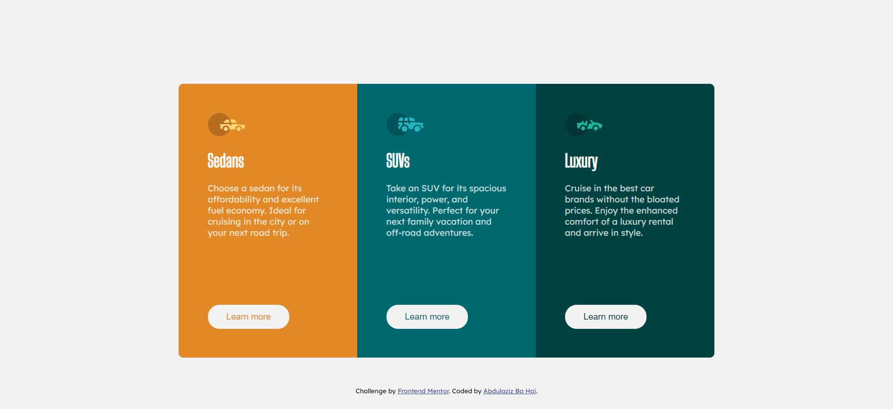

# Frontend Mentor - 3-column preview card component solution

This is a solution to the [3-column preview card component challenge on Frontend Mentor](https://www.frontendmentor.io/challenges/3column-preview-card-component-pH92eAR2-). Frontend Mentor challenges help you improve your coding skills by building realistic projects. 

## Table of contents

- [Frontend Mentor - 3-column preview card component solution](#frontend-mentor---3-column-preview-card-component-solution)
  - [Table of contents](#table-of-contents)
  - [Overview](#overview)
    - [The challenge](#the-challenge)
    - [Screenshot](#screenshot)
    - [Links](#links)
  - [My process](#my-process)
    - [Built with](#built-with)
    - [Continued development](#continued-development)
  - [Author](#author)

**Note: Delete this note and update the table of contents based on what sections you keep.**

## Overview

### The challenge

Users should be able to:

- View the optimal layout depending on their device's screen size
- See hover states for interactive elements

### Screenshot

### Links

- Solution URL: [Add solution URL here](https://abdulazizbahaj.github.io/3-column-preview-card-component/)
- Live Site URL: [Add live site URL here](https://www.frontendmentor.io/solutions/html-css-markdown-media-SeWRLN9xL)

## My process

### Built with

- Semantic HTML5 markup
- CSS custom properties
- CSS Grid
- Mobile-first workflow

### Continued development

I want to continue working on these project so i can improve my skills

## Author

- Linkedin - [Abdulaziz Ba Haj](https://www.linkedin.com/in/abdulaziz-bahaj?lipi=urn%3Ali%3Apage%3Ad_flagship3_profile_view_base_contact_details%3BFwF85v7zQTKFiGjzb6Hl4A%3D%3D)
- Frontend Mentor - [@AbdulazizBaHaj](https://www.frontendmentor.io/profile/AbdulazizBaHaj)
- FreeCodeCamp - [@abdulazizbahaj](https://www.freecodecamp.org/abdulazizbahaj)
- Twitter - [@AbdulazizBaHaj_](https://twitter.com/AbdulazizBaHaj_)
